# Git

## Git이란
Git은 분산형 버전관리 시스템으로, 소스 코드의 변경 이력을 효과적으로 추적하고, 여러 개발자 간의 협업을 가능하게 해주는 도구다.

## Git 설치 및 초기 설정

### 설치
- [Git 다운로드 사이트](https://git-scm.com/) 접속한다.
- 설치 파일을 다운받아서 설치한다.
- 커맨드 창을 열어서 버전을 확인한다.
    ```bash
    git --version
    ```
### 사용자 정보 설정
- 커맨드 창을 열어서 아래의 명령어를 실행해서 사용자 정보를 설정한다.
    ```bash
    git config --global user.name "홍길동"
    git config --global user.email "hong@example.com"
    ```
### 기본 설정 확인
- 커맨드 창을 열어서 아래의 명령어를 실행해서 기본 설정 정보를 확인한다.
    ```bash
    git config --list
    ```

## Git의 기본 구조 (4단계 저장소)
Git은 다음과 같은 4가지 주요 구조로 구성된다.

| 영역 | 설명 |
|---|---|
| Working Directory | 개발자가 실제로 파일을 생성, 수정, 삭제하는 물리적 폴더입니다. | 
| Staging Area(Index) |커밋할 변경 사항을 임시 저장하는 중간 단계입니다. (Index라고도 함) | 
| Local Repository | 커밋 이력이 저장되는 로컬 저장소입니다. 로컬 Git 저장소의 핵심 공간입니다. |
| Remote Repository | GitHub, GitLab 같은 서버에 있는 저장소로, 협업을 위해 공유하는 원격 저장소입니다. |

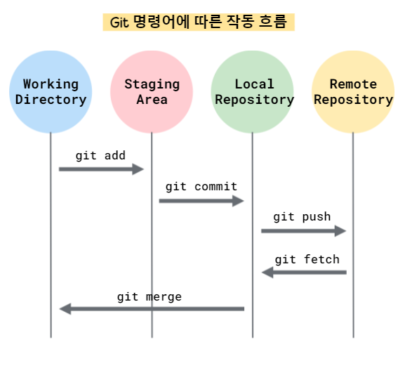

### Git 명령어 흐름 상세 설명
1. `git add`: Working Directory → Staging Area
   - 개발자가 코드를 수정한 뒤 스테이징 영역에 올리는 명령어
   - 예: `git add index.html`
   - 의미: “이 파일은 다음 커밋에 포함할 준비가 되었습니다.”

2. `git commit`: Staging Area → Local Repository
    - 준비된 변경사항을 **하나의 이력(스냅샷)**으로 로컬 저장소에 기록
    - 예: `git commit -m "로그인 기능 추가"`
    - 의미: “이 변경을 영구적으로 저장소에 기록하겠다.”

3. `git push`: Local Repository → Remote Repository
    - 로컬에서 커밋한 내용을 원격 저장소(GitHub 등)에 반영
    - 예: `git push origin main`
    - 의미: “이 커밋들을 서버에 업로드하여 팀원과 공유하겠다.”

4. `git fetch`: Remote Repository → Local Repository
    - 원격 저장소의 최신 커밋을 로컬 저장소로만 다운로드
    - 예: `git fetch origin`
    - 주의: 실제 코드에는 반영되지 않으며, 단순히 업데이트만 받습니다

5. `git merge`: Local Repository → Working Directory
    - `git fetch` 또는 다른 브랜치의 변경 사항을 작업 디렉토리에 반영
    - 예: `git merge origin/main`
    - 의미: “다운로드한 변경 사항을 현재 작업 중인 브랜치에 통합한다”
  

| 명령어 | 위치 이동 | 요약 설명 |
|---|---|---|
| `git add` | 작업 디렉토리 → 스테이징 | 커밋 준비 단계 |
| `git commit` | 스테이징 → 로컬 저장소 | 이력 저장 |
| `git push` | 로컬 → 원격 | 협업을 위한 공유 |
| `git fetch` | 원격 → 로컬 | 다른 사람의 변경 내용 가져오기 |
| `git merge` | 로컬 → 작업 디렉토리 | 가져온 변경 반영 |


## Git의 주요 명령어

### `git init`
- 현재 디렉토리를 git 저장소로 초기화한다.
- `.git` 폴더가 생성되어 git이 변경 이력을 추적할 수 있게 된다.
- 예시
    ```bash
    git init
    ```
### `git clone`
- 원격 저장소에 있는 저장소를 로컬로 복사해온다.
- `.git` 폴터를 포함한 전체 저장소가 복제된다.
- 예시
    ```bash
    git clone https://github.com/사용자명/저장소명.git
    ```
### `git status`
- 현재 작업 디렉토리에서 변경된 파일, 스테이징 여부를 확인한다.
- 예시
    ```bash
    git status
    ```
### `git add`
- 새로 생성한 파일, 변경된 파일을 Staging Area에 추가한다.
- 커밋 대상 파일을 지정하는 단계다.
- 예시
    ```bash
    git add index.jsp       # index.jsp 파일을 추가한다.
    git add .               # 현재 폴더의 모든 변경된 파일을 추가한다.
    ```
### `git commit`
- 스테이징 영역에 있는 변경 사항을 로컬 저장소에 커밋(스냅샷을 저장)한다.
- 예시
    ```bash
    git commit -m "커밋 메세지"
    ```
### `git log`
- 커밋 이력을 출력한다.
- 누가 언제 어떤 메세지로 어떤 변경작업을 했는지 확인할 수 있다.
- 예시
    ```bash
    git log
    git log -n 5            # 최근 5개 커밋 이력을 출력한다.
    ```
### `git diff`
- 현재 변경된 파일의 차이점을 출력한다.
- 예시
    ```bash
    git diff                # 작업 디렉토리 - 스테이징 영역 비교
    git diff --staged       # 스테이징 영역 - 마지막 커밋 비교
    ```
### `git branch`
- 브랜치를 조회, 생성, 삭제한다.
- 예시
    ```bash
    git branch                      # 브랜치 목록 보기                  
    git branch feature/login        # 새 브랜치(feature/login) 생성
    git branch -d feature/login     # 브랜치 삭제
    ```
### `git checkout`
- 브랜치를 전환하거나 특정 커밋/파일 상태로 이동한다.
- 예시
    ```bash
    git cheout main                 # main 브랜치로 이동
    git checkout -b feature/login   # 새 브랜치(feature/login)를 생성하고 전환
    git checkout HEAD~1 index.jsp   # 이전 버전의 파일만 복원
    ```
### `git merge`
- 한 브랜치의 변경 사항을 현재 브랜치에 병합한다.
- 예시
    ```bash
    git checkout main
    git merge feature/main          # feature/login 브랜치를 main 브랜치에 병합
    ```
### `git remote`
- 원격 저장소를 설정, 조회, 제거한다.
- 예시
    ```bash
    git remote add origin https://github.com/사용자명/저장소명.git
    git remote -v                   # 원격 저장소 주소를 확인
    ```

### `git push`
- 로컬 저장소의 커밋을 원격 저장소에 업로드한다.
- 예시
    ```bash
    git pus origin main             # main 브랜치를 origin(원격 저장소)에 업로드
    ```
### `git pull`
- 원격 자정소의 변경사항을 가져오고 자동으로 병합한다.
- `git fetch` + `git merge`의 조합이다.
- 예시
    ```bash
    git pull origin main
    ```
### `git fetch`
- 원격 저장소에서 변경사항을 가져오지만 자동 병합은 하지 않는다.
- 예시
    ```bash
    git fetch origin
    ```
### `git reset`
- 커밋 이력이나 스테이징 상태를 되돌린다.
- 실수한 커밋을 취소할 때 자주 사용한다.
- 예시
    ```bash
    git reset --soft HEAD~1         # 커밋만 취소 (스테이징은 유지)
    git reset --hard HEAD~1         # 커밋 + 스테이징 + 파일까지 삭제
    ```
### `git revert`
- 특정 커밋을 취소하는 커밋을 새로 만들어 이력을 보존하면서 되돌린다.
- 협업 중 실수한 커밋을 되돌릴 때 유용하다.
- 예시
    ```bash
    git revert 3f1eab2              # 해당 커밋을 무효화한다.
    ```

## Git 커밋
### Git 커밋이란?
- Git에서 커밋(commit)은 버전 관리의 핵심이다.
- Git 커밋은 프로젝트의 스냅샷(snapshot)을 저장소에 기록하는 단위다.
- Git 커밋은 프로젝트의 변경 이력을 기록하는 단위로, 누가, 언제, 어떤 변경을 했는지에 대한 정보를 저장한다.
- 커밋할 때마다 Git은 프로젝트의 현재 상태를 저장하며, 이력을 통해 언제든 과거로 돌아갈 수 있다.

### Git 커밋의 구성 요소

|구성 요소|설명|예시|
|---|---|---|
| 커밋 해시(commit hash) | SHA-1로 생성된 고유한 커밋 ID | a1b2c3d4e5... |
| 작성자(author) | 커밋을 만든 사람의 이름과 이메일 | 홍길동 <hong@example.com> |
| 작성 시각(date) | 커밋이 생성된 시간 | 2024-05-01 14:30:02 |
| 커밋 메시지(message) | 변경 내용 요약 | "로그인 기능 추가" |
| 부모 커밋(parent) | 이전 커밋 해시 (브랜치 히스토리 연결) | 6d8a... |
| 트리 객체(tree) | 변경된 파일들의 구조와 상태 | 내부적으로 Git이 관리 |

### 커밋 메세지 작성법
- 커밋 메세지 작성
    ```bash
    git commit -m "로그인 기능 구현"
    ```
- 좋은 커밋 메세지의 예시
    ```
    feat: 사용자 로그인 기능 추가
    fix: 로그인 실패시 메세지 오류 수정
    refactor: 중복 로그인 로직 제거
    docs: README에 로그인 설명 추가
    ```
### 커밋 정보 확인
- `git log` : 전체 커밋 로그 확인
    ```bash
    git log
    ```

    ```bash
    commit 1a2b3c4d5e6f7g8h9i0j
    Author: 홍길동 <hong@example.com>
    Date:   Fri Apr 19 10:24:35 2025 +0900

        로그인 기능 추가
    ```
### 커밋 관련 명령어

| 명령어 | 설명 |
|---|---|
| `git commit -m "메시지"` | 커밋 생성 |
| `git commit --amend` | 마지막 커밋 메시지나 내용 수정 |

## Git Workflow : 협업을 위한 단계별 실무 적용 가이드

### 전제 조건
- 프로젝트: 온라인 서점 개발
- 팀원
  - 팀장
  - 프론트 엔드 개발자 A
  - 백엔드 개발자 B
  - 테스터 C
- Git 플랫폼: GitHub
- 주요 브랜치: `main` (배포용), `develop` (통합 개발용)

### 기본 브랜치 전략

```bash
main        # 운영 배포 브랜치 (production)
develop     # 통합 개발 브랜치
feature/*   # 기능별 개발 브랜치
bugfix/*    # 버그 수정 브랜치
hotfix/*    # 긴급 운영 패치 브랜치
release/*   # 릴리즈 준비 브랜치
```

### 전체 협업 흐름 요약
1. 저장소 초기 셋팅
2. develop 브랜치 생성
3. 기능별 브랜치 생성 
4. 기능 개발 -> 커밋
5. 원격 저장소로 푸시
6. Pull Request(PR) 생성
7. 코드 리뷰와 병합
8. develop 브랜치를 내려받아서 병합 -> 3번으로 다시 돌아가서 새 기능 개발

#### 1. 저장소 초기화 및 브랜치 구조 구성 
- 팀장이 실행한다.

- 로컬 저장소를 생성한다.
    ```bash
    # 현재 프로젝트 폴더에 로컬 저장소를 초기화한다.
    git init
    ```
    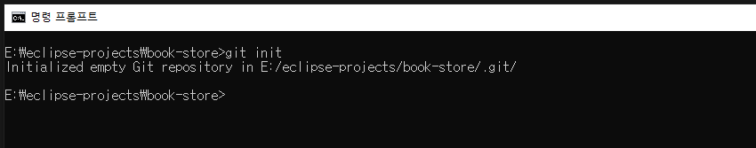

- Github에 원격 저장소를 생성한다.
    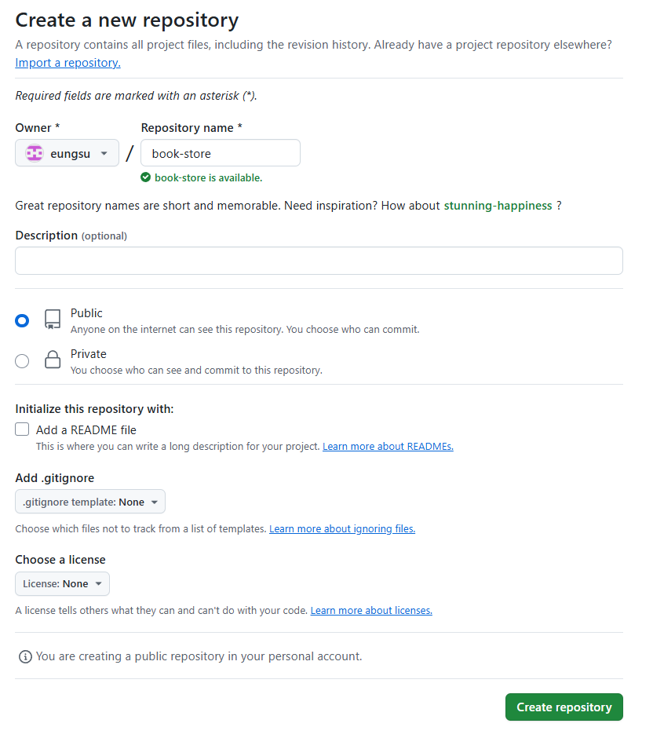

- 로컬 저장소와 원격 저장소를 연결한다.
    ```bash
    # 로컬 저장소와 원격 저장소를 연결한다.
    git remote add origin https://github.com/hong/book-store.git
    ```
    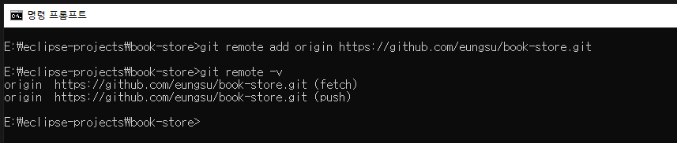


#### 2. `develop` 브랜치 생성
- 팀장이 실행한다.
- `develop` 브랜치를 생성하고 업로드 한다.
    ```bash
    # 통합 개발 브랜치를 생성하고, 브랜치를 develop로 전환한다.
    git checkout -b develop
    # 원격 저장소에 develop 브랜치를 업로드한다.
    git push -u origin develop
    ```
    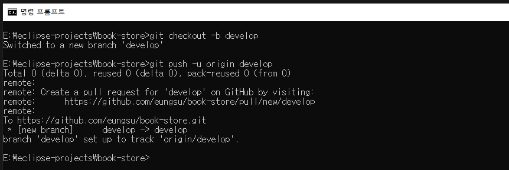
    

- 모든 개발자가 실행한다.
    ```bash
    # 원격 저장소를 복제한다.
    git clone https://github.com/hong/book-store.git

    # 원격 저장소의 develop 브랜치를 내려받는다.
    git pull origin develop
    ```
    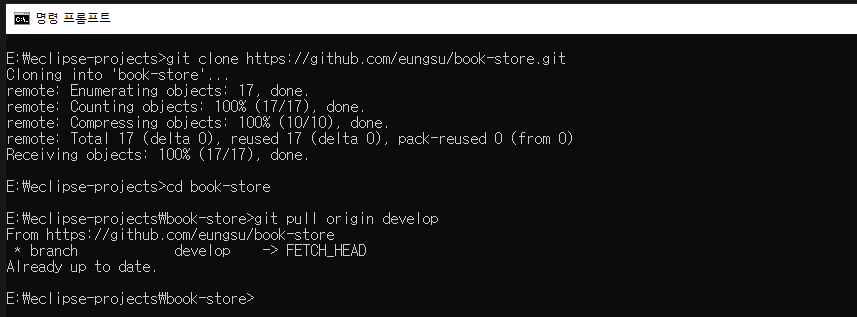

#### 3. 기능(feature) 브랜치 생성
- 로그인 기능을 개발하는 A 개발자

- `develop`브랜치로 전환 후 `feature/login` 브랜치를 생성하고 이동한다.
    ```bash
    # develop 브랜치로 전환한다.
    git checkout developt

    # 로그인 기능 개발 브랜치를 생성한다.
    # 할상 develop 브랜치에서 브랜치를 파생시킨다.
    git checkout -b feature/login develop
    ```
    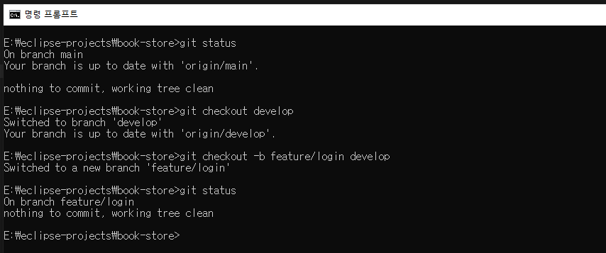

#### 4. 기능 개발 및 커밋
- 로그인 기능을 개발하는 A 개발자
- 로그인 기능 개발이 완료된 후 실행한다.

- 개발이 완료된 코드를 로컬 저장소에 저장시킨다.  
    ```bash
    # 개발이 완료된 코드를 스테이징 영역에 추가한다.
    git add .
    # 커밋 메세지를 작성하고 커밋을 실행해서 로컬 저장소에 저장시킨다.
    git commit -m "feat: 로그인 UI 및 로직 구현"
    ```
    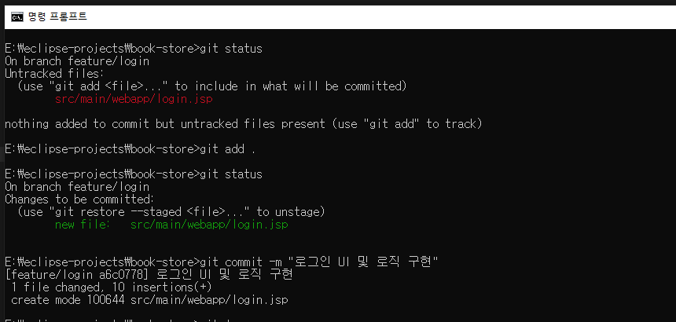

#### 5. 기능 브랜치를 원격 저장소에 푸시
- 로그인 기능을 개발하는 A 개발자

- 기능 브랜치를 원격저장소에 업로드 한다.
    ```bash
    # 원격저장소(GitHub)에 feature/login 브랜치를 푸시한다.
    # 원격저장소에 feature/login 브랜치가 생성된다.
    # 다른 팀원들도 이 브랜치의 변경사항을 확인할 수 있다.
    git push origin feature/login
    ```
    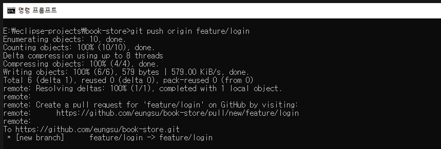
- 업로드가 완료되면 PR 작성 버튼이 표시된다.
    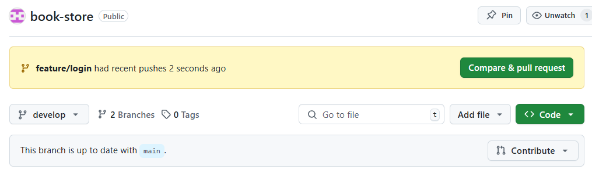

#### 6. Pull Request(PR) 작성 및 리뷰 요청
- 로그인 기능을 개발하는 A 개발자
- GitHub에서 `feature/login` -> `develop`에 PR 생성
    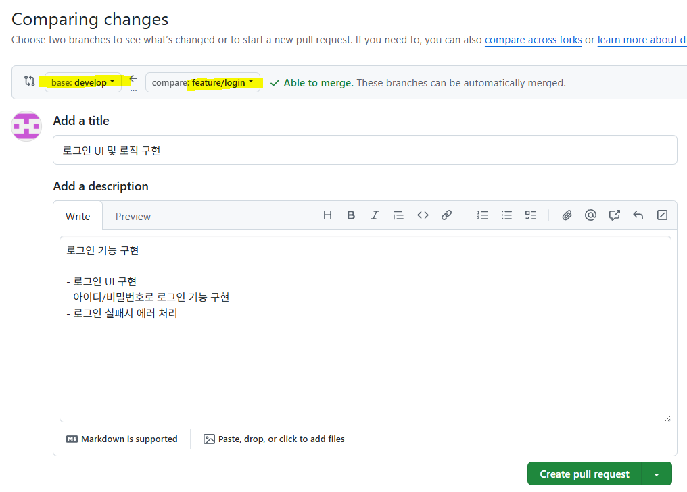

#### 7. 코드 리뷰 및 병합
- 팀장 혹은 리뷰어로 지정된 다른 개발자
- 변경된 코드를 검토한다.
    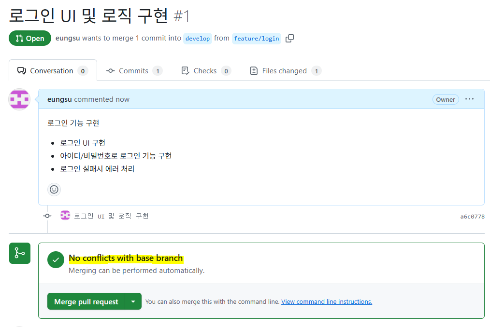
- 검토가 완료된 코드를 `develop`에 병합한다.
    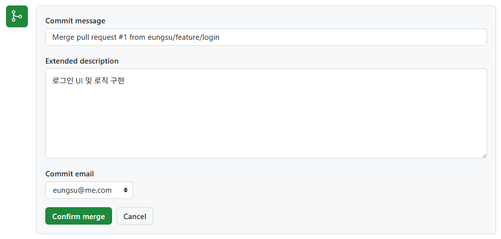
    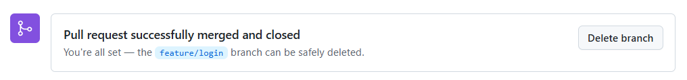

#### 8. develop 브랜치를 내려받아서 병합하기
- 모든 개발자는 `develop` 브랜치를 내려받아서 로컬 저장소에 병합시킨다.
    ```bash
    # develop 브랜치로 전환한다.
    git checkout develop

    # 원격 저장소의 develop 브랜치를 내려받아서 로컬 저장소의 develop에 병합한다.
    git pull origin develop
    ```
    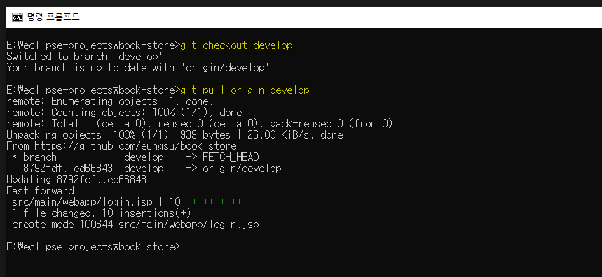

